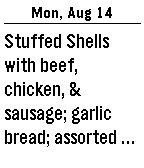
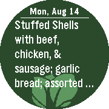
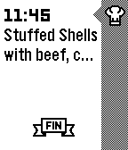
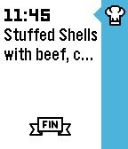
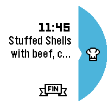
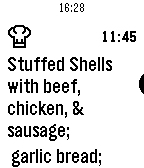
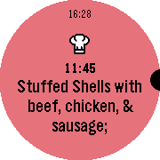

# Kabbage Lunch Pebble App

One of the perks at Kabbage is the daily catered lunch. For hack day a few years ago we built http://lunch.kabbage.com 
so we could see what was for lunch every day. It exposes a REST API that this pebble app uses. The app lets you see 
whats on the menu and also adds a pin to your time line each weekday.

